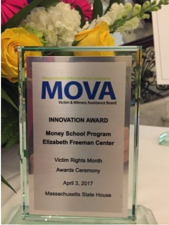

Nicole received her B.A. in Anthropology and Latin American Studies from The University of Texas at Austin and her A.M. in Social Work (Social Policy) from The University of Chicago. 

Prior to enrolling at Brown, she worked as a Senior Research Analyst in Massachusetts, where she published policy-oriented research on highly skilled immigrants in the labor market. During this time, Nicole also founded a financial education program for women through a fellowship from [Rosie’s Place](https://www.rosiesplace.org), the first women’s shelter in the United States. In 2017, the program won the [innovation award](https://www.elizabethfreemancenter.org/learn-more/moneyschool/) from the state of Massachusetts Office of Victim Assistance.

 <!-- .element style="height: 100px" -->

