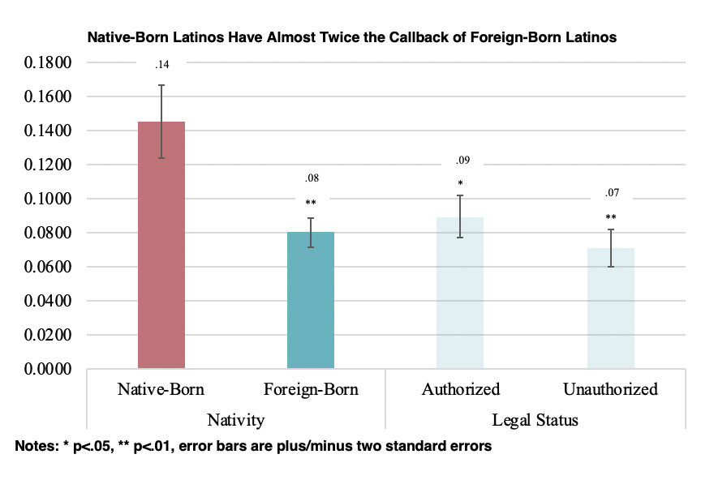

## Latino Immigrants and the School-to-Work Transition

Nicole's first book is a mixed-methods project of Latino immigrants' entire school-to-work transition. The book includes diverse data—including a correspondence audit study of 1,364 job postings in eight large metropolitan areas, a national survey experiment of 1,515 employers, and in-depth interviews with nearly 100 students, employers, college counselors, service providers, and lawyers. The book seeks to understand why often even college-educated, foreign-born Latinos are excluded from high-paying jobs after graduation. 

### Nativity Penalty and Legal Status Paradox

One article from this book project, published at [Social Forces](https://academic.oup.com/sf/advance-article-abstract/doi/10.1093/sf/soac055/6611069?redirectedFrom=fulltext), explores how college-educated Latino immigrants fare in the entry-level labor market. The paper, based on an audit study of 1,364 job postings in eight metros, finds that native-born Latinos have almost twice the callback rate as foreign-born Latinos, regardless of whether those foreign-born have signals that they are "documented" or "undocumented." 

 <!-- .element style="height: 100px" -->

An original national survey experiment and in-depth interviews with HR staff shows that both individual and organizational mechanisms explain why HR staff are reluctant to hire Latino immigrants. Individually, employers hold nativist views about Latino immigrants’ English language ability, which they perceive could threaten workplace culture. And organizationally, employers associate Latino immigrants with immigration enforcement and deportation, which they perceive could threaten workplace stability. Ultimately, the results point to the power of individual perceptions and immigration laws for hampering the employment of even documented college-educated Latinos. 

