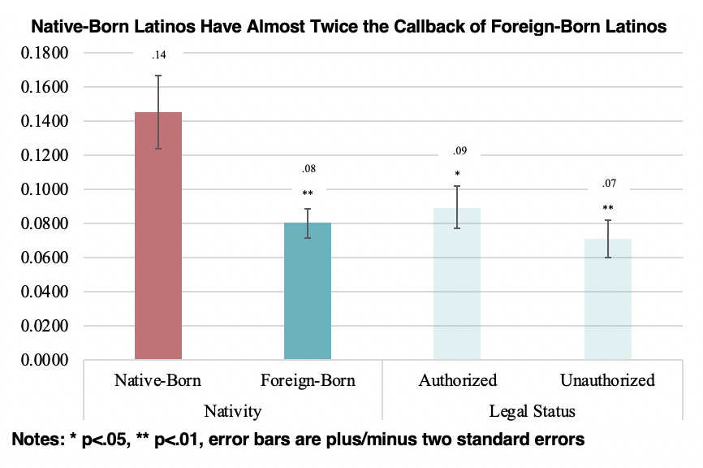

## Hiring Prospects of Latinos

Nicole's doctoral dissertation research relies on mixed-methods—including a correspondence audit study, a survey experiment, and in-depth interviews with employers, service providers, and lawyers—to examine the effects of nativity and documentation status on Latinos’ employment opportunities. 

### Law in Action: Employment Discrimination Against Immigrants

In an audit of 1,364 job postings in eight large metropolitan areas, I find that native-born Latinos have almost twice the callback rate as foreign-born Latinos,regardless of whether those foreign-born have signals that they are "documented" or "undocumented." 

 <!-- .element style="height: 100px" -->
