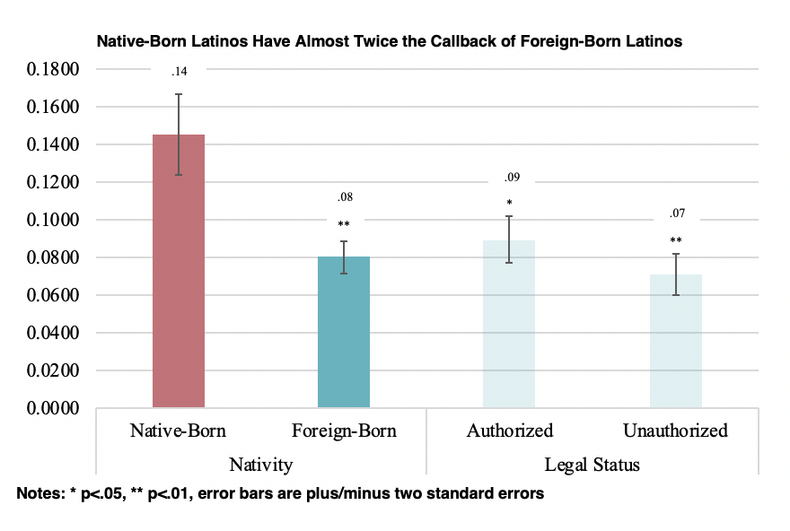

## The Hiring Prospects of U.S. Latinos

Nicole's doctoral dissertation research relies on mixed-methods—including a correspondence audit study of 1,364 job postings in eight large metropolitan areas, a national survey experiment of 1,515 employers, and in-depth interviews with 47 employers, service providers, and lawyers—to examine the effects of nativity and legal status on Latinos’ employment opportunities. 

### Employment Discrimination Against Latino Immigrants

In the audit of 1,364 job postings in eight metros, I find that native-born Latinos have almost twice the callback rate as foreign-born Latinos, regardless of whether those foreign-born have signals that they are "documented" or "undocumented." 

 <!-- .element style="height: 100px" -->

The in-depth interviews reveal that employers’ interpretation of immigration laws shapes their perceptions of risk and their attitudes toward immigrants. Specifically, enforcement laws that criminalize both documented and undocumented immigrants have led employers to associate all immigrant Latinos with an increased risk of deportation. In addition, anti-discrimination laws, which offer fewer protections to immigrants, have shaped and justified employers’ attitudes that immigrants’ lower legal standing signals lower social standing. 

 <!-- .element style="height: 100px" -->

A paper summarizing the results of this mixed-methods study is currently under review. Another working paper summarizes the results of the national survey experiment.
