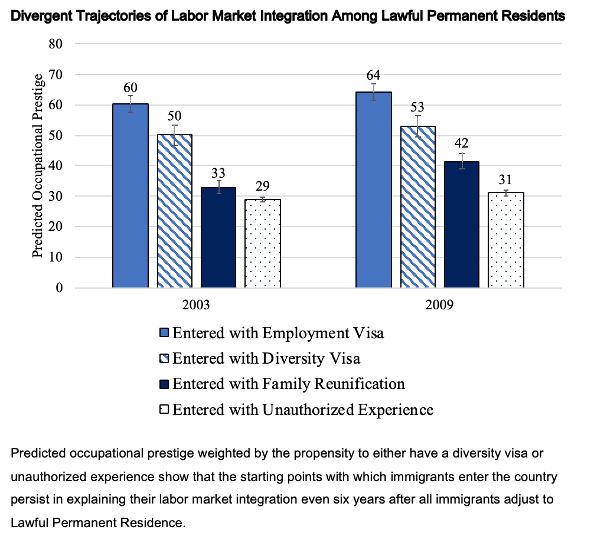
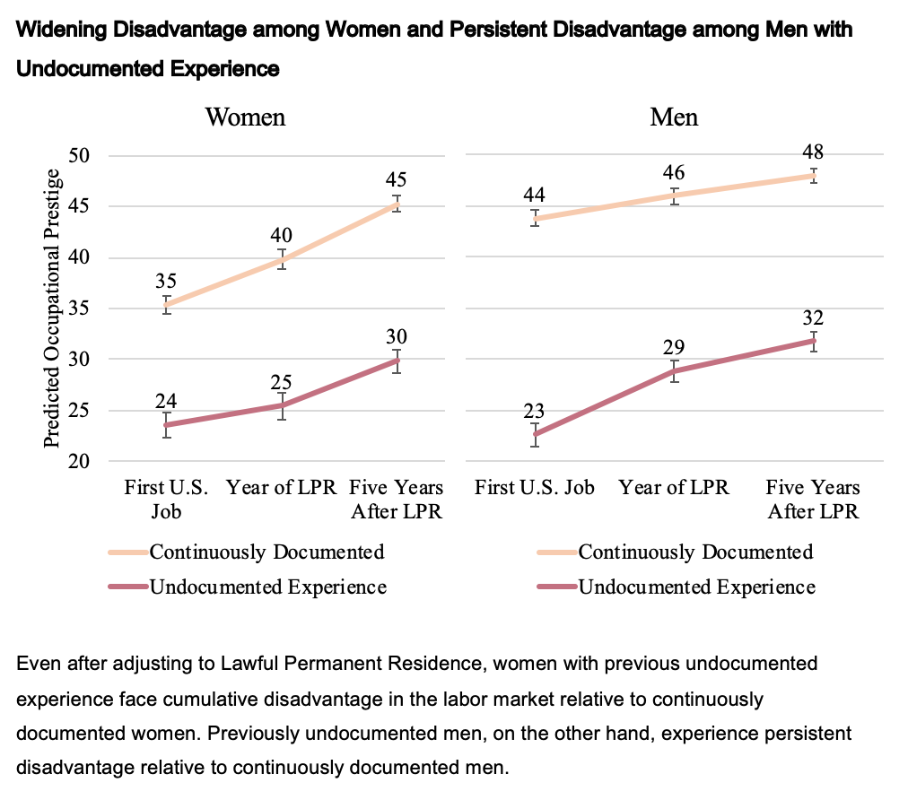

### Immigrant Inequality in the Labor Force

Nicole’s primary area of interest centers around immigrant inequalities in the labor force. In a paper published in [Social Forces](https://academic.oup.com/sf/advance-article-abstract/doi/10.1093/sf/soy128/5320369?redirectedFrom=fulltext), she evaluates whether immigrants' legal status starting points stratify their opportunities for labor market integration. She finds that immigrants' legal starting points are associated with persistent, ordered differences in immigrants’ occupational positions, even after immigrants change legal status. 

 <!-- .element style="height: 100px" -->

In Nicole’s first book project, stemming from her doctoral [dissertation](dissertation.md), she focuses on the independent effects of nativity and legal status in the labor market. Specifically, she uses a correspondence audit study, a national survey experiment of employers, and in-depth interviews to test whether and why college-educated Latino males’ nativity and legal status affect their employment opportunities. This work has been supported by the [National Science Foundation](https://www.nsf.gov/awardsearch/showAward?), and a working paper from the project can be found at [SocArXiv](https://osf.io/preprints/socarxiv/wse6n/).

In another co-authored paper at [Social Problems](https://academic-oup-com.revproxy.brown.edu/socpro), with [Els De Graauw](https://elsdegraauw.weebly.com) and [Shannon Gleeson](https://www.ilr.cornell.edu/people/shannon-glesson), Nicole uses mixed-methods to understand how structural shortcomings in federal refugee resettlement support explain declines in refugees’ employment over time. Survey data from the New Immigrant Survey show that refugees' employment rates decline over time compared to non-refugee migrants. Interviews with non-profit leaders across the U.S. illustrate that three interrelated structural weaknesses in the federal refugee resettlement process that help account for these employment declines: (1) retrenched resettlement funding, (2) a logic of self-sufficiency prioritizing rapid employment in generally undesirable and unstable jobs, and (3) siloed networks of refugee-serving organizations. 

Finally, Nicole is engagegd in research on discrimination and labor market inequalities more generally. In a paper with [Nathan Willmers](https://mitsloan.mit.edu/faculty/directory/nathan-wilmers) at [ILR Review](https://journals.sagepub.com/doi/10.1177/00197939211036444), she examines whether and why employers discriminate against men with union experience.

### Educational Inequality

A second area of research concerns inequalities in higher education. In a co-authored paper with [Amy Hsin](https://sites.google.com/view/amyhsin), published in the [Journal of Ethnic and Migration Studies](https://www.tandfonline.com/eprint/ZAHPEDBUTGXIAZGFQPN5/full?target=10.1080/1369183X.2020.1750947), Nicole examines the academic trajectories of undocumented students. She finds that despite strong academic performance in high school, undocumented students experience what she calls an educational regression in academic achievement relative to their documented and U.S.-citizen peers over time. She develops a model for describing this unique trajectory.

### Gender and Migration

Another area of interest revolves around gender and migration. In a co-authored paper under review with [Margot Jackson](https://www.brown.edu/academics/sociology/people/margot-jackson), Nicole studies how the intersection of gender and legal status shapes labor market sorting and occupational mobility over time. She finds that women experience a 'double disadvantage' in the labor market associated with prior exposure to undocumented status. This disadvantage actually widens over time. 

 <!-- .element style="height: 100px" -->

In another co-authored paper recently published at [International Migration](http://doi.org/10.1111/imig.12970) with [Elizabeth Jacobs](https://sociology.sas.upenn.edu/content/elizabeth-jacobs), Nicole revisits conventional understanding of gender differences in occupational attainment in the context of legal migration to the United States. Drawing on a quantitative and qualitative methods, she finds that a U.S. relative to a foreign education has a large premium in the global labor market, and it has the power to mitigate the gender gap in occupational attainment.

